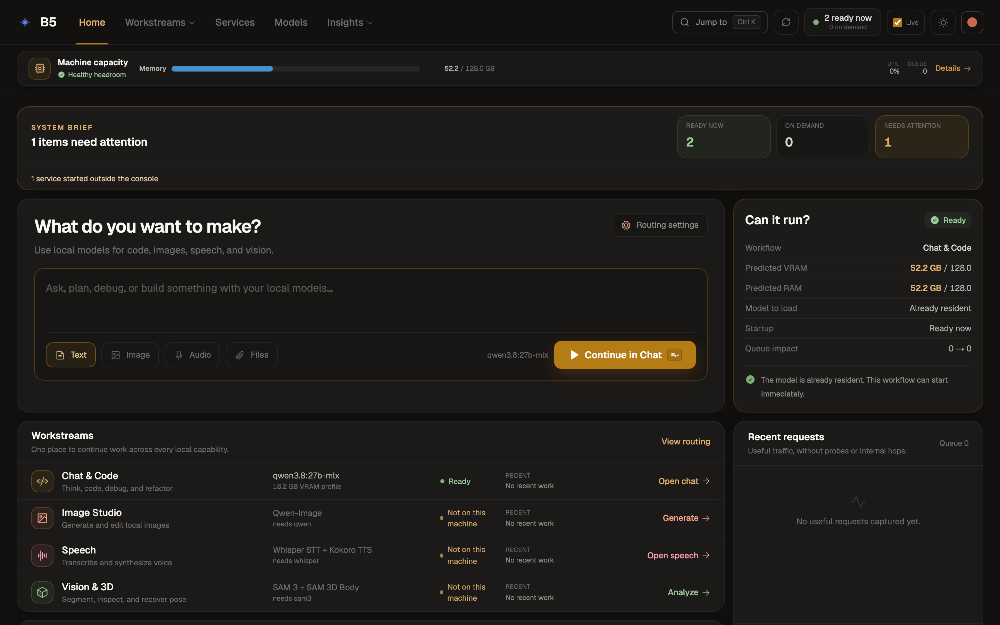
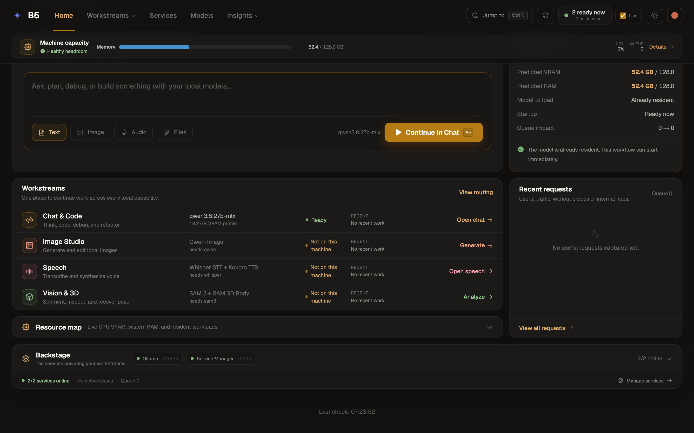
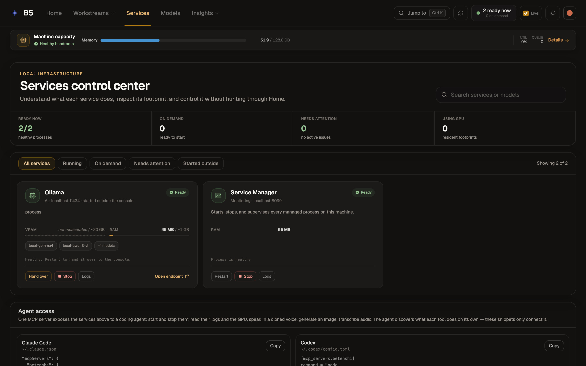
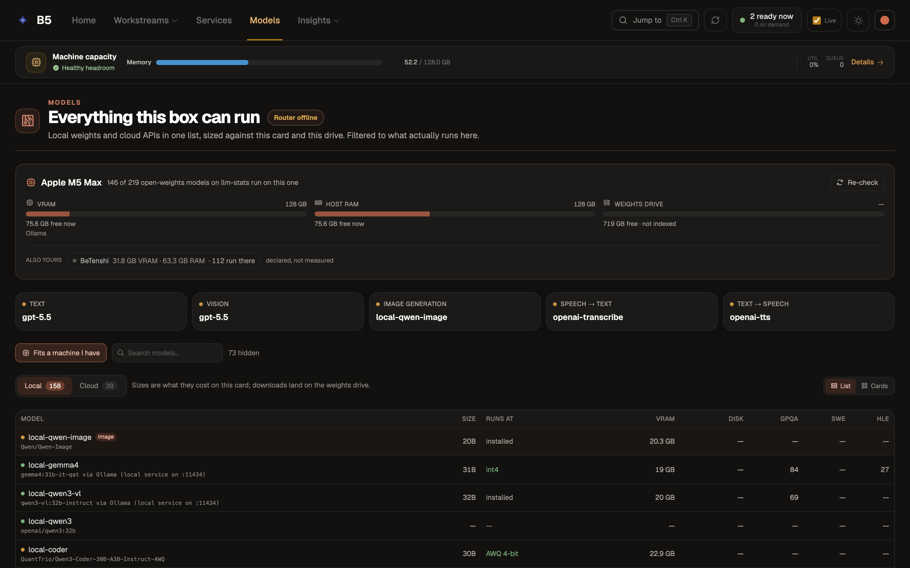
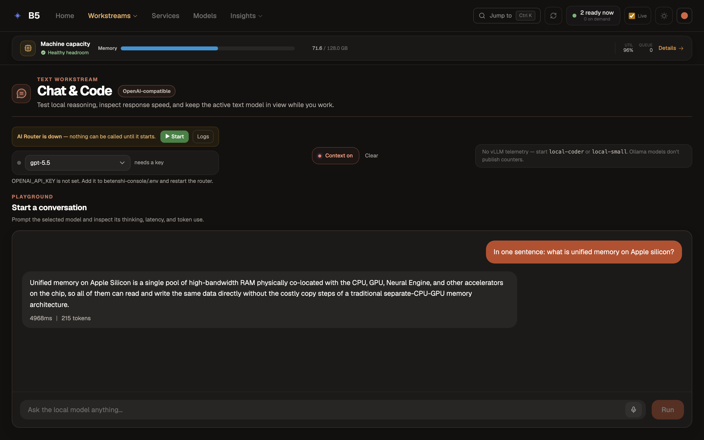
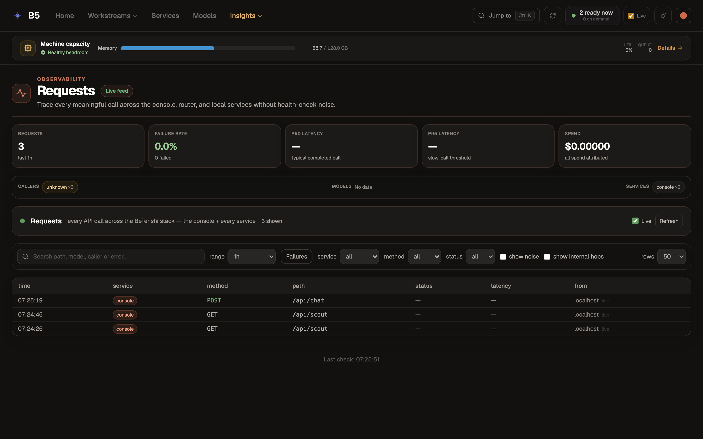

# BeTenshi Console

**One console for the AI services running on your own machines.** It starts and
stops them, keeps them inside a memory budget, routes work to whichever model
should handle it, tells you what the box can and cannot run, and shows every
call that went through it.

It is a Next.js app you run on the machine itself. There is no cloud component,
no account, and no telemetry leaving the box.



> Every screenshot in this README was captured by driving the real console with
> a real browser — see [How these screenshots were made](#how-these-screenshots-were-made).
> Nothing here is a mockup.

---

## What problem this solves

Running local AI is not one program, it is a small fleet: an inference server, a
diffusion server, speech in and speech out, a gateway in front of them, a metrics
stack behind them. Each is a separate process with its own port, its own memory
appetite and its own idea of how to be started.

The failure modes are boring and constant:

- Two services each fit in VRAM, and together they do not.
- Something is listening on the port, and it is last week's build.
- A model is "installed" but nobody can say whether *this* box can actually run it.
- Work quietly went to a cloud API because the local service was down.

This console is the single place that answers those. It is the machine's front
desk, not a chat UI that happens to have settings.

---

## The one idea worth understanding: host profiles

The console runs on more than one machine, and those machines have nothing in
common — different operating systems, different accelerators, and, critically,
**different memory models**. Rather than branching on `process.platform` all over
the code, everything a machine differs by lives in one JSON file.

```
config/hosts/
  b5.json          a MacBook Pro — Apple silicon, unified memory, Ollama
  betenshi.json    a Windows box — discrete NVIDIA GPU, vLLM, tunnelled services
  example.json     an annotated template — start here
```

A profile declares the machine's services, how its memory is budgeted, what kind
of GPU it has, and — importantly — **which workstreams it can actually back.**
The screenshot above is the Mac: the host profile knows this box has only Ollama,
so Image Studio, Speech and Vision & 3D each say *Not on this machine* rather
than offering a button into a dead tab.



Availability is always **shown, never used to hide.** A console that dropped half
its navigation on a smaller box would read as a different, smaller product — and
it would conceal exactly the thing you came to find out.

The memory model is the field that matters most:

| `memory.kind` | Means | The console then |
|---|---|---|
| `discrete` | A card and a host with **separate** budgets | Shows two bars, and refuses a model that will not fit the card |
| `unified` | Apple silicon — **one** pool shared by CPU and GPU | Shows a single Memory bar and treats a model's footprint as one number |

Getting it wrong does not throw — it silently budgets against the wrong ceiling.

**Adding a machine is adding a JSON file.** There is no code to write. Copy
[`config/hosts/example.json`](config/hosts/example.json), which documents every
field inline and is validated by the same test suite as the real profiles, so it
cannot silently rot.

---

## Quick start

Requires **Node 22 or newer** (`/api/scout` imports `node:sqlite`, a Node 22
builtin; there is an `.nvmrc`).

```bash
git clone https://github.com/alibad/betenshi-console.git
cd betenshi-console
npm install
cp .env.example .env.local     # optional — every variable in it is optional
npm run dev                    # http://localhost:8003
```

On first run the console resolves a host profile automatically: `HOST_ID` if
set, else a hostname matching a file in `config/hosts/`, else a Mac is `b5`,
else the default. It will come up against whatever is actually listening on
this machine and report everything else as on-demand or unavailable.

**The service manager is the other half.** Start/Stop buttons all go through a
supervisor on `127.0.0.1:8099`:

```bash
node scripts/manager.cjs
```

Without it the console renders but reports an empty machine — no capacity, no
ready counts, every workstream stuck on "On demand". That does not look like a
missing supervisor; it looks like an empty box. Start it first.

```bash
npm test          # 110 tests, run by node --test, no bundler needed
```

---

## The surfaces

### Services — what is running, and what it costs

Every service the host profile declares, whether or not it is up, with its live
footprint and the controls to change that. Processes started outside the console
are detected and adopted rather than duplicated — the `Hand over` button on
Ollama below exists because the Ollama menu-bar app started it, not the manager.

Below the cards, **Agent access** hands the same stack to a coding agent over a
single MCP server: start and stop services, read logs and the GPU, generate an
image, transcribe audio.



### Models — everything this box can run

Local weights and cloud APIs in one list, each sized against **this** card and
**this** drive. Not a catalogue: a verdict. The header reads *146 of 219
open-weights models on llm-stats run on this one*, and an **Also yours** row
carries the same count for every other machine you have registered — here,
*BeTenshi · 31.8 GB VRAM · 63.3 GB RAM · 112 run there*, explicitly labelled
*declared, not measured*. So "will this run, and where?" is answered before
anything is downloaded.



### Chat & Code — the local model, with its receipts

A playground against whichever text model the host is serving, showing latency
and token count for every exchange. The answer below came from `qwen3.8:27b-mlx`
running locally: 4968 ms, 215 tokens.



### Requests — every call, without the noise

A live feed of traffic across the console and every local service, with
health-check noise filtered out by default. The rows in this capture are the
walkthrough that produced this README hitting `/api/chat` — it is a photograph
of its own run.



---

## Running it as a background service

The console is meant to be there without anyone starting it.

**macOS** — two launchd agents, `RunAtLoad` + `KeepAlive`:

```bash
npm run build                 # the agent refuses to start without a .next build
./scripts/install-agents.sh
```

The plists are committed as **`.template` files** carrying a `__CONSOLE_DIR__`
placeholder. launchd requires absolute paths and will not expand `~` or read an
environment variable, so the path has to be substituted at install time — which
is what that script does. (They used to hardcode one person's home directory in
eight places.)

```bash
launchctl list | grep betenshi                        # status
launchctl kickstart -k gui/$UID/com.betenshi.console  # restart after a rebuild
tail -f var/console.log                               # logs
./scripts/install-agents.sh --uninstall               # remove
```

**Windows** — [`scripts/start-console.ps1`](scripts/start-console.ps1), driven by
a Scheduled Task at logon.

---

## Configuration

Everything is optional. A console with an empty `.env.local` runs fine against
local services. See [`.env.example`](.env.example), which documents each variable
and — more usefully — **what breaks without it**.

| Variable | For |
|---|---|
| `HOST_ID` | Force a host profile instead of detecting one |
| `PUBLIC_DOMAIN` | The domain a tunnelled host publishes its services under |
| `CF_ACCESS_CLIENT_ID` / `CF_ACCESS_CLIENT_SECRET` | Cloudflare Access service token, for reaching `authRequired` services from a *deployed* console |
| `BETENSHI_DB_PATH` / `BETENSHI_STORAGE_DB` | Move the local databases off their default path |

### A note on public hostnames

Host profiles write public URLs as `https://llm.${PUBLIC_DOMAIN}` rather than
literal hostnames. This is deliberate and it is about disclosure, not
configurability: the full list of a machine's public hostnames is a map of what
that machine exposes and what software is behind each entry. Unset,
`PUBLIC_DOMAIN` resolves to `example.com`, which fails obviously rather than
plausibly. Local use never touches it — `getServiceUrl()` returns the localhost
URL whenever the console and its services are on the same box.

---

## Layout

```
src/app/            one page (hash-routed tabs) + 54 API routes
src/components/     one component per surface
src/lib/            host.ts resolves the profile; everything else hangs off it
config/hosts/       the machines — add one by adding a file
config/             router aliases, resource policy, model metadata
scripts/            the service manager, launchd templates, tests, experiments
docs/               design notes and model experiments
```

Two things are worth knowing before reading the code:

- **`src/lib/host.ts` is the spine.** The profile is resolved once, in
  `next.config.ts`, and published as `NEXT_PUBLIC_HOST_ID`. Nothing below it
  calls `os`, because two client components import the service registry and
  `os` does not bundle for the browser.
- **Profiles are data, not TypeScript**, because `scripts/manager.cjs` is
  CommonJS and has to read the same file the app does. That retired a
  hand-copied second service list which had already drifted.

---

## Status

This is a personal tool that has been running daily on two machines. It is
shared because the host-profile approach is reusable, not because it is a
product. Concretely:

- **No license yet.** `package.json` claims ISC but there is no `LICENSE` file,
  so default copyright currently applies. Treat it as source-available until
  that is settled.
- **Two machines' worth of testing.** Windows/NVIDIA and macOS/Apple silicon. A
  Linux profile would probably work and has never been run.
- **Known rough edges**, found by walking the app rather than by reading it:
  - `/api/metrics` hardcodes the service id `vllm`, so on a host without a vLLM
    service every page load takes a 502. The UI now degrades honestly — Chat
    says *No vLLM telemetry … Ollama models don't publish counters* rather than
    showing blank tiles — but the route itself still throws rather than
    reporting that this host has no such service.
  - The model picker hardcodes the AI Router, so a host whose profile declares
    no router reports it as *down* — and offers a Start button for a service
    that host does not have — rather than saying it is not on this machine.
  - A few user-visible strings say "BeTenshi" where they mean "this machine",
    including the Requests subtitle in the screenshot above, seen under a header
    that reads **B5**. One of them also names the wrong file: the Chat screenshot
    reads *"Add it to betenshi-console/.env"*, where the documented location is
    `.env.local`.

---

## How these screenshots were made

They were not taken by hand. A walk script drives the real console in a real
browser, performs the interactions, and captures what happened:

```bash
node scripts/walk-console.mjs
```

It uses the capture layer from
[Walkthrough Studio](https://github.com/alibad/walkthrough-studio), which
enforces — by measuring the output, not by trusting the flag it passed — that
every capture is Retina, that the viewport is really the size it asked for, that
animations are frozen so frames are deterministic, that no capture is a
near-empty frame, and that **no two captures in a walk are too similar to be
distinct states**.

That last one earned its keep here. The walk originally captured a third chat
state — the prompt typed but not yet sent — and the layer rejected it: it
changed 0.9% of the frame against the arrival shot. The bytes differed, so a
naive checksum would have passed it, but a reader would have seen the same
screen twice. The step was dropped rather than forced through, which is why the
chat section above has two captures and not three.

The walk also reports what it saw go wrong. The three rough edges listed under
[Status](#status) are all findings from this run, not notes from reading the
source.

**Captured 2026-09-19**, against the application code at `d9e5a31`, on a
MacBook Pro (Apple M5 Max, 128 GB) running the `b5` profile with Ollama and the
service manager up.

The console in these images is therefore an honest picture of a *small* host:
two services, one workstream, a router that isn't running. The Windows box runs
thirteen services. Nothing was started specially for the photographs.
